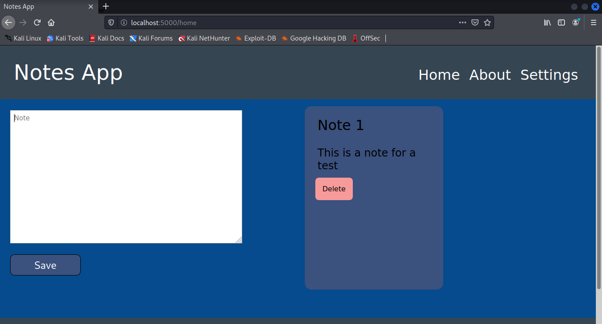

# Python Notes App.

__This is a small web application maked with flask-python for add notes easily and quickly.__

## Dependencies.
__You can create a virtual enviroment and install the dependencies with the requirements file, executing:__

```bash
$ pip3 install -r requirements.txt
```

## Run.
__For run the app we placed in the project folder and execute:__

```bash
$ python3 index.py
```

__Or:__

```bash
$ python3 -m index
```

## Screenshot.

